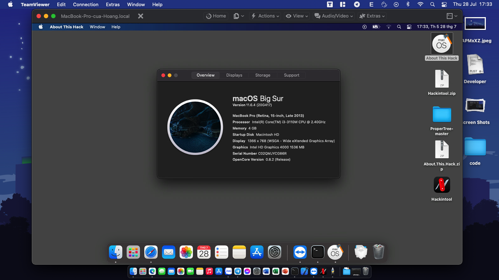

# 
Acer Travelmate P253-M
 
## Versions
|macOS|Bootloader|
|--------|------|
|Mojave 10.14.6| OpenCore 0.7.8|
## Screenshots

## Laptop specs
|                     | Specifications| 
| ---------------------------- | ---------------------- |
| ``Chipset``| Intel Ivy Bridge|
| ``CPU``| Intel Core i3-3110M 2.40GHz|
| ``Memory``| 4GB DDR3-1333MHz, up to 8GB|
| ``GPU``| Intel HD Graphics 4000|
| ``Storage``| ADATA SU650 120GB|
| ``Screen``| 15.6" 1366 x 768|
| ``Ethernet``| null |
| ``WiFi and Bluetooth``| Qualcomm Atheros AR9485|
| ``Audio``| ALC269 |
| ``Keyboard``| - |
| ``Touchpad``| ELAN, PS/2|
| ``Dimensions``| 25.4mm x 381.6mm x 253mm|
|``Weight``|2.6kg| 

## Features (Update Later)
